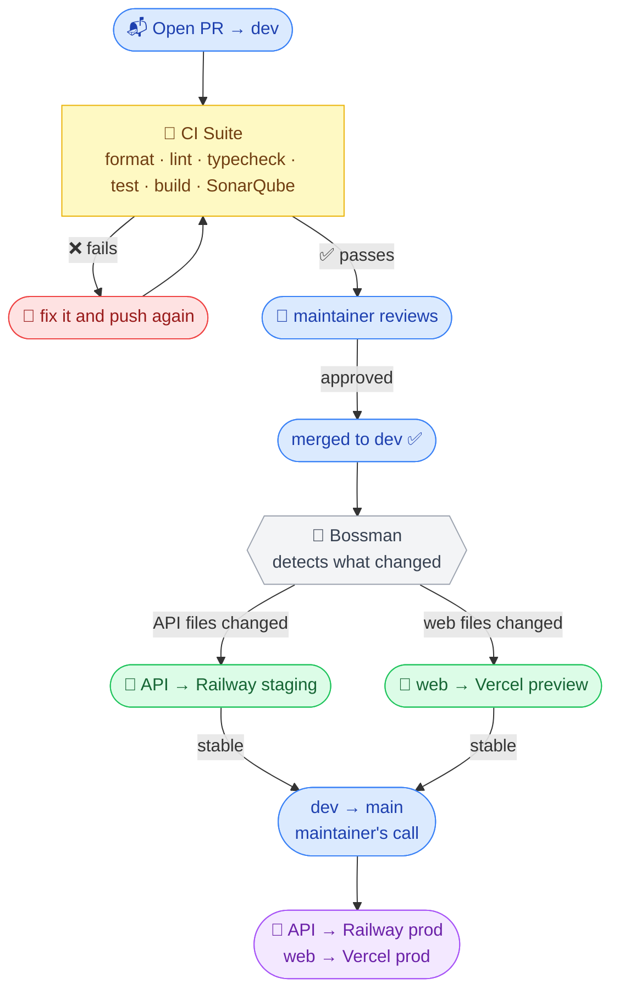

# Contributing to Indexfolio

This is a solo-maintained open-source project and contributions are genuinely welcome. Extra hands help it grow faster and reach more investors across Europe.

Read this before opening anything. It is short.

---

## 🔍 Before you start

- Search open issues before creating a new one
- For anything non-trivial, open an issue first and talk it through before writing code
- Small fixes (typos, bugs, docs) - just open a PR, no need to ask permission

---

## 🌿 The branch flow

```
your-fork/your-branch → dev → main
```

**PRs go to `dev`. Always.** PRs targeting `main` get closed without review - nothing personal, that's just how the flow works. The `dev → main` merge and production deploy happen when a batch of changes is stable on staging and the maintainer is happy with it.

---

## 🚀 Get it running

Full instructions in [README.md](./README.md). Quick version:

```bash
pnpm install
pnpm docker:up
pnpm --filter @indexfolio/api prisma:migrate
pnpm --filter @indexfolio/api prisma:seed
pnpm dev
```

---

## 📝 Submitting a PR

1. Fork the repo and branch off `dev`

```bash
git checkout dev && git pull origin dev
git checkout -b your-branch-name
```

2. Make your changes
3. Run the checks locally before pushing

```bash
pnpm lint
pnpm typecheck
pnpm test
```

4. Commit using conventional commits (format below)
5. Push and open a PR targeting `dev`

---

## ⚡ What happens after you push

No surprises - here is the full CI/CD pipeline:



Your job ends at getting the PR green and approved. The rest is automatic.

---

## 🎯 The quality bar

This is the part that actually matters - read it properly.

**TypeScript strict is on and `any` is not welcome here.** If you are wrestling the type system to make something work, the types are right and the approach needs rethinking. No bullshit escape hatches.

**Logic changes need tests.** New feature? Write tests. Bug fix? Write a regression test. The suite runs in Vitest. Mock at the boundary (PrismaClient, external APIs) - not inside business logic.

**The bar goes up, not down.** A PR that adds something useful while weakening types, skipping tests, or introducing inconsistency will not land - even if the feature itself is solid. This is not gatekeeping, it is how things stay maintainable without a full team behind it.

If something feels like a hack, it probably is. Do it properly or discuss it first.

---

## 💬 Commit messages

[Conventional Commits](https://www.conventionalcommits.org/). Husky enforces this locally - if a commit bounces, check the format.

```
feat: add portuguese tax module
fix: correct accumulating ETF filter
docs: update local dev setup steps
test: add pagination regression tests
refactor: simplify ETF serialisation
chore: bump prisma to 6.2
ci: fix deploy workflow concurrency
data: add holdings for VWCE
style: format swagger plugin
```

Imperative tense, lowercase, no trailing period.

---

## 🚫 What will not be merged

- PRs targeting `main`
- New dependencies outside the approved stack without prior discussion
- Features with significant maintenance surface without a prior issue
- UI changes without screenshots
- Anything that removes or weakens the financial advice disclaimer
- Breaking changes without prior discussion

Not sure if something will land? Open an issue first - always better than a wasted PR.

---

## 🌍 Highest-value contribution: a country tax module

EU investors in different countries face completely different tax treatment for ETFs - exit taxes, stamp duties, dividend withholding, you name it. Each country lives as an isolated module in `packages/tax-engine/`. One file, its tests, and you are done.

**Only contribute a module if you are a tax resident of that country or have verified the rules against official government sources.** Include your sources in the PR. Wrong numbers mean wrong decisions for real people - this one matters more than most.

See open issues for the spec and template.

---

## 🗣️ Community

Questions, ideas, and discussion live in [GitHub Discussions](https://github.com/aravindasiva/indexfolio/discussions). Issues are for bugs and concrete feature requests only.

Be decent. If you are rude, harass anyone, or make the space worse for others - you are out. No long drawn-out process about it.
