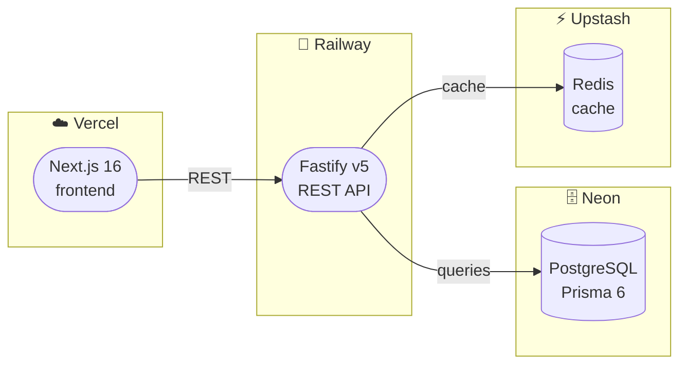
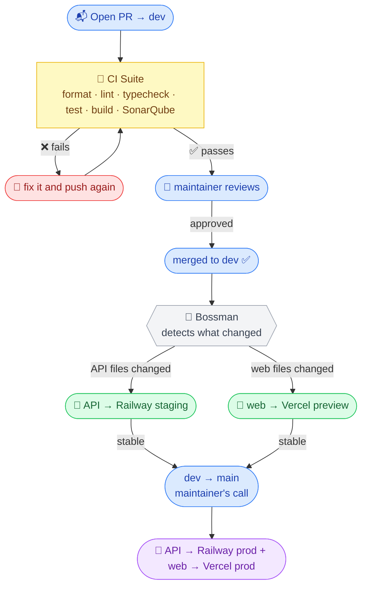

# Indexfolio

> Open-source tools for European passive investors. Filter UCITS ETFs, run the numbers, and understand what you actually own.

[](https://github.com/aravindasiva/indexfolio/actions/workflows/ci.yml)
[](https://sonarcloud.io/summary/new_code?id=aravindasiva_indexfolio)
[](https://www.typescriptlang.org/)
[](./LICENSE)
[](./CONTRIBUTING.md)
[](https://github.com/aravindasiva/indexfolio/stargazers)

Indexfolio is a free, open-source toolkit for navigating passive investing in Europe. An ETF screener that actually understands UCITS, accumulating vs distributing funds, TERs, domiciles, and all the other things that matter to EU retail investors. No account. No paywall. No upsell.

Built first for Portugal. Expanding to the rest of the EU as the project grows.

---

## What's here

| Tool                       | Status   | Description                                                                                     |
| -------------------------- | -------- | ----------------------------------------------------------------------------------------------- |
| ETF Screener               | **Live** | Filter UCITS-compliant ETFs by TER, domicile, accumulating/distributing, fund size, asset class |
| Tax Calculator             | Planned  | After-tax projections using actual country tax rules, not generic estimates                     |
| Portfolio Overlap Analyser | Planned  | See what you actually own when combining multiple ETFs                                          |
| Knowledge Graph            | Planned  | An interactive map of how investing concepts connect                                            |

---

## Architecture



---

## Stack

| Layer    | Tech                                |
| -------- | ----------------------------------- |
| Frontend | Next.js 16, Tailwind CSS, shadcn/ui |
| API      | Fastify v5, Zod, TypeScript strict  |
| Database | PostgreSQL (Neon), Prisma 6         |
| Cache    | Redis (Upstash)                     |
| Monorepo | Turborepo, pnpm workspaces          |
| Infra    | Vercel (web), Railway (API)         |
| Testing  | Vitest                              |

---

## Run it locally

**Prerequisites:** Node.js 20+, pnpm, Docker

```bash
# 1. Clone and install dependencies
git clone https://github.com/aravindasiva/indexfolio.git
cd indexfolio
pnpm install

# 2. Set up the API environment
cp .env.example apps/api/.env

# 3. Start Postgres and Redis
pnpm docker:up

# 4. Run migrations and seed ETF data
pnpm --filter @indexfolio/api prisma:migrate
pnpm --filter @indexfolio/api prisma:seed

# 5. Start everything
pnpm dev
```

| Service            | URL                        |
| ------------------ | -------------------------- |
| Web                | http://localhost:3000      |
| API                | http://localhost:3001      |
| API docs (Swagger) | http://localhost:3001/docs |

To stop: `pnpm docker:down`

---

## Contributing

PRs are welcome. Read [CONTRIBUTING.md](./CONTRIBUTING.md) before opening one - it is short and covers everything you need.

The most valuable contribution right now is a **country tax module**. If you live in an EU country and can verify your country's ETF tax rules against official government sources, that is the thing that helps the most people. Check the open issues for the spec.

Got questions or ideas? Drop them in [GitHub Discussions](https://github.com/aravindasiva/indexfolio/discussions). Issues are for bugs and concrete feature requests only.

If this is useful to you, a [star](https://github.com/aravindasiva/indexfolio/stargazers) helps other investors find it.

### How a contribution flows

Open your PR to `dev` (never `main`). Here is what happens next:



Once your PR is green and approved, the rest is automatic. Deployments to staging happen on merge to `dev`, and production happens when `dev` gets merged to `main`.

### What we care about

- **TypeScript strict is on.** No `any`, no bullshit workarounds. If you are fighting the types, rethink the approach.
- **New logic needs tests.** Feature? Write tests. Bug fix? Write a regression test.
- **The bar only goes up.** A PR that adds something useful but weakens types or skips tests will not land. That is not gatekeeping, it is just how a solo-maintained project stays alive.

Full details in [CONTRIBUTING.md](./CONTRIBUTING.md).

---

## Contributors

Thanks to everyone who has contributed. ([emoji key](https://allcontributors.org/docs/en/emoji-key))

<!-- ALL-CONTRIBUTORS-LIST:START - Do not remove or modify this section -->
<!-- prettier-ignore-start -->
<!-- markdownlint-disable -->
<!-- markdownlint-restore -->
<!-- prettier-ignore-end -->
<!-- ALL-CONTRIBUTORS-LIST:END -->

---

## Support

Indexfolio is free and always will be. Running costs come out of pocket (hosting, DB, Redis - roughly $10/month).

If it is useful to you and you want to help keep it running:

- [GitHub Sponsors](https://github.com/sponsors/aravindasiva) - recurring support via GitHub
- [Ko-fi](https://ko-fi.com/aravindasiva) - one-time or recurring

All support goes to infrastructure. The project will never be monetised.

---

## Disclaimer

Educational information and calculations only. Nothing here is financial advice. Make your own decisions. Consult a qualified professional if you need one.

---

## License

[MIT](./LICENSE) - use it, modify it, build on it.
